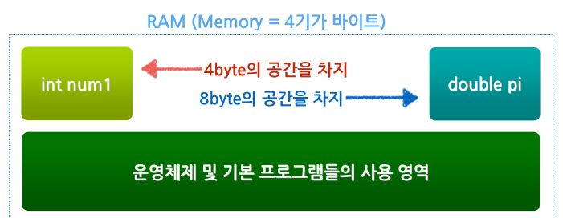

# 프로그래밍 언어의 이해

## 1. 변수의 이해


### 1) 수학에서 말하는 변수
방정식에서 다양한 값들이 대입될 수 있는 미지수(x)를 변수라고 말한다.

<br>

### 2) 프로그램에서 말하는 변수
다양한 종류의 자료로 표현할 수 있는 값을 변수라고 하며 프로그램에서 처리하고자 하는 '데이터'에 해당한다.

|수학에서 말하는 변수 | 프로그램에서 말하는 변수|
|:--:|:--|
|자연수, 정수, 실수, 무리수 등| 프로그램에서 사용하는 모든 데이터를 표현할 수 있다.(사용자 입력값, 화폐단위, 이름, 나이, 주소 등)|

<br>

### 3) 수 체계

수학에서 방정식은 주어진 변수에 어떤 형식의 숫자든 대입할 수 있지만, 프로그램에서 변수는 반드시 지정된 종류의 값만을 사용해야 한다.

<br>

### 4) 데이터 저장 방식

- 컴퓨터는 모든 데이터를 **0 또는 1로 구성된 이진수**로 저장한다.
- 이진수 값 하나를 비트(1 bit)라고 하며 1비트는 2개의 정로로 표현이 가능하다.
- 2비트는 두 자리 이진수이므로 총 네 개의 데이터로 표현할 수 있다.
    - 00, 01, 10, 11
- 비트가 하나씩 늘어날 때마다 표현이 가능한 값이 두 배로 증가한다. 즉, N개의 비트에는 총 2^N개의 정보를 저장할 수 있다.

<br>

### 5) 컴퓨터의 크기 단위
- 8비트가 모인 단위를 1byte라 하며, 2^8개(256개)의 정보를 갖는다.
- 1024byte = 1kybyte
- 1024kbyte = 1Mbyte
- 1024Mbyte = 1Gbyte
- 1024Gbyte = 1Tbyte

<br>

### 6) 기본 자료형 (data type)

메모리에 저장된 0과 1의 데이터를 해석하는 방법으로 사용된다.

|자료형|설명|
|:--:|:--|
|없음(None)|NULL 값 개체|
|정수(int)| 일반정수(예: 32)|
|부동소수점(float)|부동소수점 수. 10진수 또는 exponent sign을 포함하는 숫자|
|복소수(complex)|복소수. 실수부와 허수부의 합으로 된 숫자로 표현|
|논리값(Boolean)|참(True) 또는 거짓(False)값, (1과0의 숫자로 표현)|
|문자열(String)|문장형태, (쌍따옴표나 홑따옴표로 감싸진 문자열)|

<br>

### 7) 자료형이 가지는 의미
- 모든 변수는 컴퓨터 메모리 영역에 생성된다.(여기서 말하는 메모리는 일반적으로 PC에 설치하는 RAM을 의미한다.)
- 보통 정수(int)형 변수는 4byte의 크기를 갖으며 int형 변수 값 하나를 생성할 경우 PC의 RAM에서 해당 용량만큼을 사용하게 된다. (PC 사양 혹은 성능에 따라 int형 변수의 크기는 변할 수 있다.)
- 변수는 RAM의 크기를 넘지 않는 범위 안에서만 생성된다.(용량을 초과할 경우 에러가 발생함.)


<br>

### 8) 변수의 사용방법

대입연산자("=")를 사용하여 변수에 값을 대입할 수 있다. (보통 우변에서 좌변으로 대입됨.)
```
    변수이름 = 값
```

사용 예
```python
>>> num1 = 100  #변수의 생성
```

<br>

### 9) 변수 이름 규칙
- 영어, 숫자, 언더바(_)의 조합으로 정의한다.
- 첫 글자는 반드시 영어로만 지정할 수 있다.
- 띄어쓰기가 불가능하다.
- 필요한 경우, 언더바를 사용하거나 그 위치의 글자를 대문자로 변경하여 사용한다.
    - ex)hello + world -> hello_world 또는 helloWorld

<br>

### 10) 변수의 사용 제약

정의되지 않은(=값이 할당되지 않은) 변수는 사용할 수 없다.
```python
>>> num = 100
>>> print(number)
100
>>>print(myage)
Traceback (most recent call last):
   File "<stdin>", line 1 in <module>
NameError: name 'myage' is not defined
```

<br>

### 11) 다양한 숫자형 변수의 정의
- 변수만들기 ( 이름 = 값)

```python
a = 123
b = -456
print(a)    #123
print(b)    #-456

# 한 번 할당된 변수는 다른 값으로 변경 가능
a = 10000
print(a)    #10000

# 실수형 변수 만들기
c=1.2
d= -3.45
print(c)    #1.2
print(d)    #-3.45

# 지수형태(알파벳e 혹은 E사용)
e = 4.24e10     #4.24 * (10의 10제곱)
f = 4.24e-10        #4.24 * (10의 -10제곱)
print(e)        #42400000000.0
print(f)        #4.24e-10

# 8진수 표현(숫자0 + 알파벳o + 숫자값)
g = 0o177
print(g)        #127

#16진수 표현(숫자0 + 알파벳x + 숫자값)
h = 0xABC
print(h)    #2748
```

- 복소수 사용
```python
i = 1+2j
print(i)    #(1+2j)

#복소수에서 실수 조회
print(i.real)   #1.0

#복소수에서 허수 조회
print(i.imag)   #2.0

#켤레복소수
print(i.conjugate())    #(1-2j)

# 복소수 절대값
print(abs(i))   # 5
```

- 논리형 변수
```python
a = True    # 다른 언어(ex:C#, java)와 다르게 파이썬에서 'true'는 첫 글자가 대문자여야 함.
print(a)    # True

b = False   # 다른 언어(ex:C#, java)와 다르게 파이썬에서 'false'는 첫 글자가 대문자여야 함.
print(b)    # False 

c = not a   # 'not'은 부정을 의미함.
print(c)    # a의 반대는 'False'

d = not b
print(d)    # b의 반대는 'True'
```

<br><br>


## 2. 함수의 이해


### 1) 파이썬에서 함수의 정의

```python
def 함수이름(입력값):
    함수에 속한 명령어
    return 리턴값
```
1. 함수이름 : 함수의 기능을 사용하기 위해 정의된 함수를 코드에 적는 것을 함수를 호출한다고 표현한다. 함수를 호출할 때 사용되는 식별자가 함수이름이 된다.

2. 입력값(파라미터, 매개변수) : 함수의 이름 옆에 위치한 소괄호 안에 명시한다. 만일, 입력값이 필요하지 않다면 괄호안을 비워둔다.

3. 리턴값 : 함수를 호출한 곳에 되돌려 주는 결과값

4. 함수에 속한 명령어 : **동일한 depth의 들여쓰기**가 적용되어야 한다.(다른 언어에서 괄호({})의 역할과 동일하며 SCOPE의 의미이다.)

#### 함수 호출의 예시
```python
def f(a):
    b = a+100
    return b

plus =f(100)    #함수 f()가 리턴하는 값을 plus에 저장한다.
print(plus)     #print() 함수가 plus를 출력한다.
```

<br><br>

## 3. 객체(개체, Object)의 이해

개체는 변수와 함수를 내장하는 변수와 같다.

### 개체의 사용 예

```python
print(member.userid)    #member 개체 안에 정의된 userid (맴버)변수를 사용
member.join()           #member 개체 안에 정의된 join함수를 사용
member.login()          #member 개체 안에 정의된 login 함수를 사용
```

참조: (https://blog.itpaper.co.kr/)의 교육자료