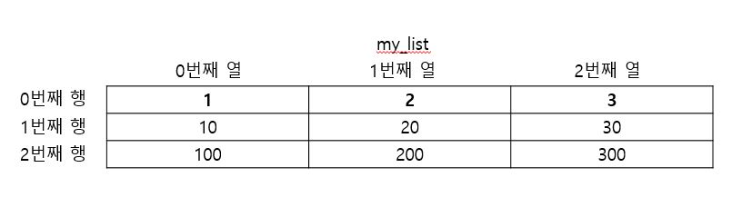

## 1. 리스트의 이해

#### 예시

```
문제:아래의 학급성적표를 통해 각 학생들의 총점과 평균점수를 구하라.
```

|이름|국어|영어|수학|
|:--:|:--:|:--:|:--:|
|둘리|75|82|91|
|도우너|88|64|50|
|또치|100|100|90|
|마이콜|70|0|0|

```python
dooly_kor = 75
dooly_eng = 82
dooly_math = 91
total1 = dooly_kor + dooly_eng+ dooly_math
avg1 = total1/3

douneo_kor = 88
#나머지 코드 생략
```

위 예시처럼 프로그램에서 처리해야 하는 값들이 증가할 수록 선언해야 하는 변수의 수가 증가하게 되어 프로그램 소스가 난해해 진다.

리스트는 변수를 그룹으로 묶은 형태의 한 종류이다. 따라서 하나의 리스트 안에 **서로 다른 종류의 데이터**가 저장될 수 있다.

<br>

### 리스트 생성

리스트 생성
```
리스트 이름 = [값1, 값2, 값3, ... , 값n]
```
생성된 리스트는 배열과 같은 형태로 생성되며 배열 형태의 칸은 0부터 시작하는 index가 지정된다.


#### 예시
둘리의 점수를 리스트로 표현
```python
dooly = [75, 82, 91]
```


리스트 값 활용
```python
print(dooly[0])                         # 원소 하나를 출력
ko = dooly[0]                           # 원소 하나를 다른 변수에 복사
sum = dooly[0] + dooly[1] + dooly[2]    # 각 원소들의 합
```

<br>

## 2. 다차원 리스트

1. 1차원 리스트
    - 한 줄로 존재하는 리스트
    - 행렬 중 행에 대한 구분이 필요 없는 상태

2. 2차원 리스트
    - 1차원 리스트의 각 칸에 새로운 리스트를 넣는 형태
    - 1차원 리스트의 각 칸은 행이되고 각 칸에 추가한 리스트가 '열'의 개념이 되어 '행렬'을 구성한다.

3. 다차원 리스트
    - 리스트의 각 칸에 리스트를 넣어 1차원을 늘린 리스트가 된 것처럼 리스트의 가 칸에 리스트를 지속적으로 넣어 원하는 차원의 리스트를 만들 수 있다.

<br>

### 1) 2차원 리스트 개념

```python
a = [1,2,3]
b = [10,20,30]
c = [100, 200, 300]

my_list=[a, b, c]       #my_list=[[1,2,3], [10,20,30], [100,200,300]]
```


<br>

### 2) 2차원 리스트의 행 접근

```python
my_list=[[1,2,3], [10,20,30], [100,200,300]]
print(my_list[0])       #[1,2,3]
print(my_list[1])       #[10,20,30]
print(my_list[2])       #[100,200,300]
```
<br>

### 3) 2차원 리스트의 원소에 접근하는 방법


```python
my_list=[[1,2,3], [10,20,30], [100,200,300]]
print(my_list[0][0])       #1 : 0번째 행의 0번째 열에 접근 
print(my_list[0][1])       #2 : 0번째 행의 1번째 열에 접근
print(my_list[1][2])       #30 : 1번째 행의 2번째 열에 접근
print(my_list[2][2])       #300 : 2번째 행의 2번째 열에 접근
```

<br><br>

## 3. 리스트의 indexing & slicing

리스트의 indexing : 문자열과 동일하게 indexing을 사용하여 값에 접근 가능

```python
mylist = [10, 20, 30, 40, 50]
#indexing
print(mylist[1])        #20
print(mylist[-1])       #50

#slicing
print(mylist[1:3])      #[20,30]
print(mylist[:3])       #[10, 20, 30]
print(mylist[3:])       #[40, 50]
print(mylist[:])        #[10, 20, 30, 40, 50]
print(mylist[1:-2])     #[20, 30] : 음수 index -2를 기본 index로 표현하면 3이된다.
```

<br>

### 1) 리스트 연산

리스트는 리스트 간의 덧셈과 리스트와 정수의 곱셈이 지원된다.

```python
list1 = [1,2,3]
list2 = [4,5,6]

#리스트간의 덧셈으로 병합
list3 = list1 + list2
print(list3)        #[1,2,3,4,5,6]

#리스트와 정수의 곱은 동일한 내용을 반복한다.
list4 = list1 * 3
print(list4)        #[1,2,3,1,2,3,1,2,3]

"""
에러코드
print(list3+10)         #리스트 + 정수
print(list3 + "hi")     #리스트 + 문자열
print("list1*list2)     #리스트 * 리스트
"""
```

<br>

### 2) 리스트의 확장 및 축소

```python
#대입연산자를 이용한 단일 요소 수정
mylist = [1,2,3]
mylist[2] =4
print(mylist)       #[1,2,4]

#대입연산자를 이용하여 주어진 범위의 요소 수정
mylist= [1,2,3]
mylist[1:3]= [20,30]
print(mylist)       #[1, 20, 30]

#주어진 범위보다 작은 개수를 갖는 리스트 대입 ->리스트 축소
mylist = [1,2,3]
mylist[1:3] =[1000]
print(mylist)       #[1, 1000]

#주어진 범위보다 요소가 많은 리스트를 대입 -> 리스트 확장
mylist = [1,2,3]
mylist[1:2]=[7,8,9,0]
print(mylist)       #[1,7,8,9,0]
```

<br>

### 3) 리스트 요소(원소) 삭제

```python
#특정 위치의 요소 삭제
mylist=[1,2,3,4,5]
del(mylist[1])
print(mylist)       #[1,3,4,5]

#특정 범위의 요소 삭제
mylist=[1,2,3,4,5]
del(mylist[1:3])
print(mylist)       #[1,4,5]

#특정 범위의 요소를 삭제하는 다른 방법
mylist=[1,2,3,4,5]
mylist[1:3]=[]
print(mylist)       #[1,4,5]
```

<br>

### 4) 리스트의 요소 삽입과 확장 비교

```python
#index로 접근하는 경우
mylist=[1,2,3,4,5]
print(mylist)           #[1,2,3,4,5]
mylist[1] = [100, 200]
print(mylist)           #[1,[100, 200],3,4,5]

#slicing으로 접근하는 경우
mylist=[1,2,3,4,5]
print(mylist)           #[1,2,3,4,5]
mylist[1:2] = [100,200] 
print(mylist)           #[1,100,200,3,4,5]
```

<br>

## 4. 리스트 관련 함수

```python
#전체 원소의 개수 조회
mylist=[1,2,3]
size=len(mylist)
print(size)         #3

#리스트 마지막 index 다음에 내용을 추가
mylist=[1,2,3]
mylist.append(4)
print(mylist)       #[1,2,3,4]

#리스트에 append로 2차원 리스트를 삽입
mylist=[1,2,3]
mylist.append([5,6])
print(mylist)       #[1,2,3,[5,6]]

#중간 삽입 : insert(index,삽입할 값)
mylist=[1,2,3]
mylist.insert(1,10)
print(mylist)       #[1, 10, 2, 3]

#맨 마지막 요소를 꺼내고 삭제
mylist=[1,2,3]
k = mylist.pop()
print(k)            #3
print(mylist)       #[1,2]

print(mylist.pop()) #2
print(mylist)       #[1]

#리스트 확장
mylist=[1,2,3]
addn = [10,9,8,7]
mylist.extend(addon)
print(mylist)       #[1,2,3,10,9,8,7]

#주어진 값과 일치하는 원소의 개수 세기
mylist=[1,2,3,2]
c = mylist.count(2)
print(c)            #2

#해당값이 가장 처음 나타나는 위치
mylist=[1,2,3,19,1,2,3,10]
x = mylist.index(10)
print(x)            #3

#주어진 값과 일치하는 첫 번째 요소를 삭제
mylist=[1,2,3, 10, 1,2,3,10]
mylist.remove(10)
print(mylist)       #[1,2,3,1,2,3,10]

#순서 뒤집기
mylist=[1,3,5,7,9]
mylist.reverse()
print(mylist)       #[9,7,5,3,1]

#순차정렬
mylist=[2,5,1,6,3]
mylist.sort()
print(mylist)       #[1,2,3,5,6]

#역순정렬
mylist=[2,5,1,6,3]
mylist.sort(reverse=True)
print(mylist)       #[6,5,3,2,1]

#문자열을 리스트로 변환하는 함수
text = "Hello, Python,World,Good"
mylist = text.split(",")
print(mylist)           #['Hello', ' Python', 'World', 'Good']
```

참조 : 호쌤의 교육자료, (<https://blog.itpaper.co.kr/>)