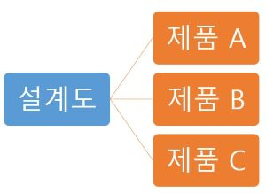

# 파이썬 객체지향(1)

## 1. 객체지향 프로그래밍의 이해
- 객체지향 프로그래밍

```
객체가 중심이 되는 프로그래밍 패러다임
```

- 객체(Object)
    - 사전에서 의미
    ```
    물건이나 어떠한 대상
    ```

    - 프로그래밍에서 객체
    ```
    프로그램에서 표현하고자 하는 기능을 묶기 위한 단위
    ```

- 객체를 구성하는 단위
    데이터와 기능

    - 데이터는 변수로 표현됨.(객체 안에 포함된 변수를 `멤버변수` 혹은 `프로퍼티`라 한다.)
    - 기능은 메서드(함수)로 표현됨.

<br><br>
    
## 2. 클래스와 객체
```
객체의 설계도 역할을 하는 프로그램 소스
```


- 공장에서 하나의 설계도를 사용하여 여러개의 제품을 생산할 수 있는 것처럼 하나의 클래스를 통해 동일한 구조를 갖는 객체를 여러 개 생성할 수 있다. (대표적인 예 : 게임 Unit)

<br>

### 1) 클래스 작성 방법

- 변수와 함수를 특성에 따라 객체라는 형태로 그룹화하기 위한 기법이 클래스를 작성하는 것이다.
```python
class 클래스이름:
    멤버변수

    def 메서드이름(self [,파라미터]):
    ...하위 코드...
        [return 값]
```

- `class`라는 예약어와 클래스의 이름을 명시하고 콜론(`:`)을 사용하여 블록(Scope)을 구성한다.

- 멤버변수와 메서드는 필요에 따라 여러 개 존재할 수 있다.

    - 멤버 변수에는 값을 선언과 동시에 할당할 수 있고 객체를 통해 간접적으로 할당할 수 있다.

    - class에 속하는 모든 메서드는 첫 번째 파라미터로 `self`를 명시해야 한다.

<br>

### 2) 클래스 객체 생성하기
- 함수를 호출하는 것과 비슷한 구성을 갖는다.
```
변수이름 = 클래스이름()
```

- 위와 같은 형태로 생성된 변수를 `객체`라고 부른다.
- 객체는 클래스 안에 정의된 모든 기능(멤버변수, 메서드)을 부여받는다.
- 객체에서 부여된 기능은 점(`.`)을 통해 접근할 수 있다.

<br>

#### 클래스 안에 정의된 멤버변수 접근하기
```
print(객체.멤버변수)
변수 = 객체.멤버변수
```

##### 예제 코드
```python
class Member:
    userid= "python"
    email = "python@gmail.com"
    phone = "01012345678"

mem1 = Member()
print(mem1.userid)
print(mem1.email)
print(mem1.phone)

# 정의된 클래스는 재사용 할 수 있다.
mem2 = Member()
mem2.userid="hello"
mem2.email = "hello@gmail.com"
mem2.phone = "01087654321"
print(mem2.userid)
print(mem2.email)
print(mem2.phone)
```

```
python
python @gmail.com
01012345678
hello
hello @gmail.com
010876543
```

<br>

#### 클래스 안에 정의된 메서드에 접근하기
```
객체.메서드()
```

<br><br>

## 3. 메서드를 포함하는 객체

### 1) 클래스에서 메서드 정의하기
- 파이썬에서 클래스에 포함되는 모든 메서드의 첫 번째 파라미터로 `self`를 정의하도록 규정하고 있다.

```python
class Calc:
    def sum(self, x, ,y):
        return x+y
```

- 기능활용 : 객체에 부여된 메서드를 호출하여 결과값 리턴받기

    메서드에 정의된 self파라미터는 객체를 통해 메서드가 호출될 때는 값을 전달받지 않는다.
    ``` python
    c1 = Calc()
    a = c1.sum(100,200)

    c2 = Calc()
    b = c2.sum(200,300)
    ```

<br><br>

## 4. self 용법
`self`는 자신을 의미하는 키워드

- 클래스 안에 포함된 메서드간에 서로 호출해야할 경우 "반드시" self를 통해 접근해야 한다.

```python
class Calc:
    def plus(self,x,y):
        return x + y

    def minus(self, x,y):
        return x - y

    def all(self, x, y):
        z = self.plus(x,y) * self.minus(x,y)
        return z
```
<br>

#### 예시코드
- 객체에 내장된 함수 사용
```python
#함수만을 내장하는 클래스 정의
class Calc:
    def plus(self,x,y):
        return x + y

    def minus(self, x,y):
        return x - y

    def all(self, x, y):
        a = self.plus(x,y)
        b = self.minus(x,y)
        return (a,b)
# 객체에 내장된 함수 사용
my  = Calc()

print(my.plus(10,20))
print(my.minus(100,50))
print('-'*10)

a = my.all(10, 20)
print(a[0])
print(a[1])
print('-'*10)

p,m = my.all(100,200)
print(p)
print(m)
```
```
30
50
----------
30
-10
----------
300
-100
```

참조: (https://blog.itpaper.co.kr/)의 교육자료