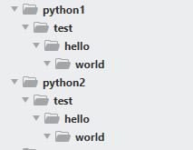

## 1. 파이썬 내장 모듈 소개

- 모듈

    ```
    1. 프로그램에서 자주 사용될 기능들을 별도의 파일로 분리해 놓은 것
    2. 재사용 가능한 단위(함수, 클래스, 객체)들을 다른 프로그램에서 활용할 목적으로 분리해 놓은 형태
    ```

- 파이썬 내장 모듈

    ```
    1. 파이썬의 기본 기능(내장함수)들을 확장하고 추가적인 기능들을 사용할 수 있도록 해주는 모듈
    2. 파이썬에 내장되어 있어 별도의 구현과정 없이 import를 통해 사용 가능함.
    ```

- 파이썬 내장 모듈들

|기능|모듈|
|:--:|:--:|
|시스템 정보| sys, os|
|파일, 디렉토리 작업 | os, shutil, glob|
|날짜, 시간 관련 작업 | datetime
|메일 관련 작업| smtplib, email|

<br><br>

## 2. 운영체제 이름 조회하기 / 운영체제 명령어 수행하기

- sys 모듈이 갖는 platform 변수는 현재 구동중인 운영체제의 이름을 반환한다.

- 이 값을 활용하여 운영체제 종류에 따라 다른 코드가 적용될 수 있도록 조건문을 구성할 수 있다.

#### 예제 코드

```python
import sys
import os

print(sys.platform)
print("-"*30)

# 윈도우 = win32, mac = darwin, linux = linux1 또는 linux2
if sys.platform =='win32':
	command = 'dir'
else:
	command ='ls -l'

os.system(command)
```

```
win32
```

### 운영체제별 CLI 명령어 수행하기

- os 모듈에 내장된 system() 함수는 파라미터로 전달된 문자열을 명령어 형태로 실행하고 그 결과를 출력한다.
    - 윈도우의 경우 `명령 프롬프트`에서 수행 가능한 명령어를 파라미터로 전달한다.
    - 맥이나 리눅스의 경우 `터미널`에서 수행 가능한 명령어를 파라미터로 전달한다.

```python
import sys
import os

# 운영체제가 윈도우인 경우와 그 밖의 경우를 나누어 command 변수를 생성
if sys.platform =='win32':
    command = 'dir'
else:
    command ='ls -1'

# 시스템 명령어를 수행하여 결과를 즉시 출력
os.system(command)
```
<br><br>

## 3. 파일 및 폴더 관련 작업

### 1) OS 모듈을 활용한 파일 작업

- 폴더나 파일의 존재 여부 검사하기

    - os 모듈의 path 객체에 포함되어 있는 exists 함수를 사용

    ```python
    # helloworld.txt 파일이 존재하면 True, 없으면 False 반환
    k = os.path.exists("helloworld.txt")
    ```

- 폴더 트리 생성
    - os 모듈의 mkdir()함수는 주어진 경로의 최종 폴더만 생성하므로 중간 단계의 폴더가 존재하지 않으면 실행시 에러가 발생한다.
    
    ```python
    # life 폴더나 is 폴더가 없다면 short 폴더를 생성하지 못하고 에러가 발생
    os.mkdir("life/is/short")
    ```

    - os 모듈의 makedirs() 함수는 중간단계의 폴더가 없더라도 최종 폴더까지 순차적으로 폴더를 생성한다.
    
    ```python
    # life 폴더나 is 폴더가 없다면 순차적으로 생성
    os.makedirs("life/is/short")
    ```
<br>

#### 예시코드

- getcwd() : 작업하는 파이썬 소스코드의 위치 조회하기

```python
import os
import sys

#현재 작업중이 폴더(Current Wording Directory)위치 확인
print(os.getcwd())
```

```
D:\python
```

<br>

- listdir() : 상대경로 방식으로 현재 폴더의 하위 항목들 조회하기

```python
import os
import sys

# 특정 폴더에 포함되어 있는 항목 조회 : listdir()
ls = os.listdir('./')
print(ls)
```

```
['os1.py', 'mod1.py',]
```

<br>

- 절대경로 방식으로 특정 폴더의 하위 항목들 조회하기

```python
if sys.platform == 'win32':
    target ='C:\\'
else:
    target="/"

ls = os.listdir(target)
print(ls)
```
```
['$Recycle.Bin', 'Documents and Settings', 'Duzon', 'DuzonBizon', 'Ers', 'hiberfil.sys', 'Intel', 'NIPCPA_ADB', 'pagefile.sys', 'PerfLogs', 'Program Files', 'Program Files (x86)', 'ProgramData', 'Python38', 'Recovery', 'swapfile.sys', 'System Volume Information', 'Temp', 'tools', 'Users', 'Windows', '포맷 후 설치파일']
```
<br>

- 경로 관련 작업

```python
import os

#특정한 폴더나 파일의 존재여부 확인
k = os.path.exists('./hello')
print(k)

#절대경로 확인 (존재하지 않더라도 경로값은 확인 가능함.)
print(os.path.abspath('./hello'))
```

```
False
D:\python\hello
```
<br>

- 폴더의 생성과 삭제

```python
if k ==False:
    # mkdir() : 폴더 생성
    os.mkdir('.hello')
    print('hello폴더를 생성했습니다.')
else:
    #rmdir() : 폴더삭제
    os.rmdir('./hello')
    print('hello폴더를 삭제했습니다.')
```
최초 실행 : 폴더가 존재하지 않으므로 폴더를 생성함.
두 번째 실행 : 첫 번째 실행결과로 인해 폴더가 있는 상태이므로 폴더를 삭제함.
<br>

### 1)  shutil 모듈을 활용한 파일 작업

#### 파일, 폴더의 이동

- shutil 모듈의 move()함수를 사용하면 파일을 이동할 수 있다.

```python
# C 드라이브의 hello.txt 파일을 d드라이브의 world.txt로 이동
shutil.move("C:/hello.txt", "D:/world.txt")
```
<br>

- move()함수를 사용하여 같은 폴더 안에서 이름만 변경하는 것도 가능하다.

```python
# 현재 폴더의 good.txt 파일을 같은 폴더의 nice.txt로 이동 -> 파일이름 변경
shutil.move("good.txt", "nice.txt")
```
<br>

#### 폴더 트리 복사

- shutil의 copytree()함수는 특정 폴더를 복사한다.

- 원본 폴더 하위에 다른 파일이나 폴더가 포함되어 있다면 하위 항목들도 함께 복사된다.

```python
# 현재 폴더 내의 need 폴더를 python으로 복사
shutil.copytree("need", "python")
```
<br>

#### 예시 코드

- 사용할 모듈을 import하여 폴더 존재에 따른 코드 분기

```python
import os
import shutil

if os.path.exists('python1')==False and os.path.exists('python2') ==False:
	os.makedirs('python/test/hello/world', exist_ok=True)
	print("python 폴더와 하위 폴더를 생성했습니다.")

	if os.path.exists('python1')==False:
		shutil.move('python', 'python1')
		print('python 폴더를 python1으로 이동했습니다.')

	if os.path.exists('python2')==False:
		shutil.copytreen('python1', 'python2')
		print('python 폴더를 python2으로 이동했습니다.')
else:
    #rmtree(): 폴더트리 삭제
	shutil.rmtree('python1')
	shutil.rmtree('python2')
	print('python1, python2 폴더가 삭제되었습니다.')
```
최초 실행 시 : 폴더를 생성하고 그 결과를 이동, 복사한다.
```
python 폴더와 하위 폴더를 생성했습니다.
python 폴더를 python1으로 이동했습니다.
python 폴더를 python2으로 이동했습니다.
```



두 번째 실행 시: 생성된 폴더들이 삭제된다.
```
python1, python2 폴더가 삭제되었습니다.
```
<br>

- 사용할 모듈을 import하여 파일 존재에 따른 코드 분기

```python
import os
import shutil

if os.path.exists('hello.txt')==False:
	with open("hello.txt", "w")as f:
		f.write("Life is too short, you need python")
		print("hello.txt파일을 생성했습니다.")

	shutil.copy('hello.txt', 'world.txt')
	print('hello.txt가 world.txt로 복사되었습니다.')


else:
	os.remove('hello.txt')
	print('hello.txt가 삭제되었습니다.')

	os.remove('world.txt')
	print('world.txt가 삭제되었습니다.')
```
최초 실행 시 : 파일을 생성하고 그 결과를 이동, 복사한다.

```
hello.txt파일을 생성했습니다.
hello.txt가 world.txt로 복사되었습니다.
```

두 번째 실행 시: 생성된 파일들이 삭제된다.
```
hello.txt가 삭제되었습니다.
world.txt가 삭제되었습니다.
```

<br>

### 2) Glob 모듈을 통한 파일 필터링

- glob 모듈에 정의되어 있는 glob함수는 특정 형식의 파일들의 목록을 조회하는 기능을 제공한다. 파일 검색 기능을 사용해야 할 경우 사용된다.

- 모듈 이름과 함수 이름이 동일하기 때문에 함수와 모듈간의 혼동을 줄 수 있으므로 import 후에 별칭을 사용하여 이름을 구분 짓는 것을 권고된다.

```python
import glob
file_list = glob.glob("*.txt")

#별칭을 통한 import처리
import glob as gl
file_list = gl.glob("*.txt")
```
<br>

#### 예시 코드

- Glob 모듈을 이용한 파일 필터링

```python
import glob as gl

#현재 폴더의 모든 하위 요소를 조회
ls= gl.glob('*')
print(ls)
print('-'*30)

# 현재 폴더에서 ".txt*로 끝나는 모든 요소를 조회
ls = gl.glob('*.txt')
print(ls)
print('-'*30)

# 현재 폴더에서 '0'으로 시작하는 모든 요소를 조회
ls=gl.glob('0*')
print(ls)
```

```
['06-os1.py', '07_usermod1.py', '08_usemod2.py', '09_usermod3.py', '10_usemod4.py', '13-usemod7.py', '14-usemod8.py', '15-usemod9.py', '17-os2.py', '18-os3.py', '19-shutil.py', '20-shutil2.py', '21-glob.py', 'grade.csv', 'grade.py', 'grade.scv', 'hello.txt', 'hellopython.txt', 'helloworld.txt', 'list.py', 'list2.py', 'my_mod1.py', 'my_mod2.py', 'my_mod3.py', 'secion06_01-obj1.py', 'secion06_02-obj2.py', 'secion06_03-obj3.py', 'secion06_04-obj4.py', 'secion06_05-obj5.py', 'secion06_06-my_mod1.py', 'secion06_06-obj6.py', 'secion08', 'section07', 'section09', 'section10', 'star.py', 'test.py', 'usemod5.py', 'usemod6.py', 'world.txt', '__pycache__', '연습문제10.py', '연습문제11.py', '연습문제12.py', '연습문제13.py', '연습문제8.py', '연습문제9.py']

-- -- -- -- -- -- -- -- -- -- -- -- -- -- --
['hello.txt', 'hellopython.txt', 'helloworld.txt', 'world.txt']

-- -- -- -- -- -- -- -- -- -- -- -- -- -- --
['06-os1.py', '07_usermod1.py', '08_usemod2.py', '09_usermod3.py']
```

참조 : 호쌤의 교육자료, (<https://blog.itpaper.co.kr/>)