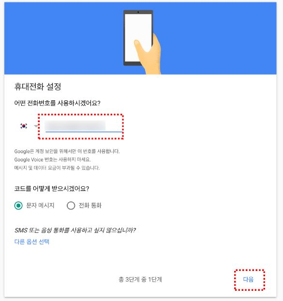
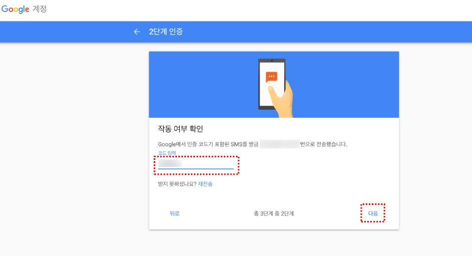
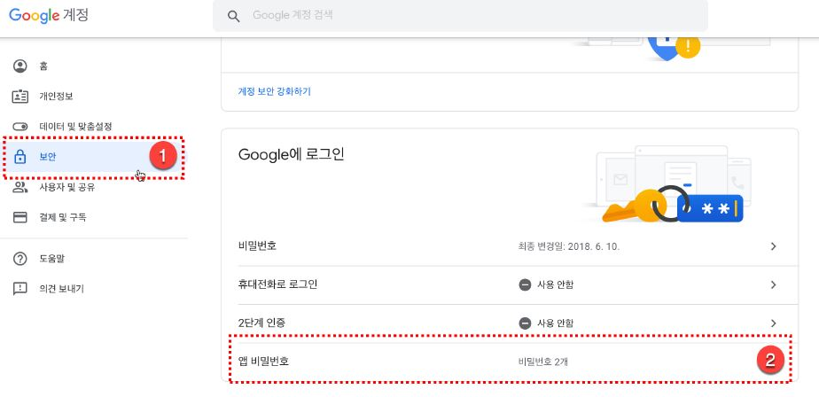
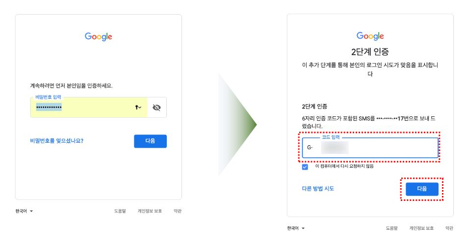
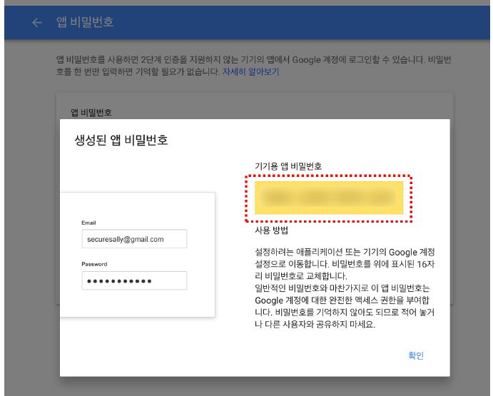

# 파이썬 내장모듈(3)

## 1. 메일 발송을 위한 구글 연동
### 1) 구글 연동을 위해 구글에 로그인한 후 `Google 계정` 버튼을 클릭한다.


<br>

### 2) 보안메뉴로 이동 후 2단계 인증 메뉴를 선택한다.


<br>

### 3) 2단계 인증하기


<br>

### 4) 비밀번호 확인


<br>

### 5) 휴대전화 번호 선택 후 인증번호 받기



<br>

### 6) SMS로 전송된 인증번호 확인하기



<br>

### 7) 2단계 인증 사용 확인


<br>

### 8) 전 단계 화면으로 돌아가 다시 `보안`메뉴를 선택 후 `앱 비밀번호`를 선택



<br>

### 9) 2단계 인증 로그인



<br>

### 10) 앱 종류 선택 및 이름 지정하기


<br>

### 11) 발급되는 비밀번호 확인



<br><br>

## 2. 메일 발송 기본 구조

#### 예시코드

```python
import os.path                                      #경로 정보를 얻기위한 모듈
from smtplib import SMTP                            #발송서버와 연동하기 위한 모듈
from email.mime.text import MIMEText                #본문 구성 기능
from email.mime.application import MIMEApplication  # 파일을 Multipart 형식으로 변환
from email.mime.multipart import MIMEMultipart      #파일을 본문에 추가하는 기능 제공

#--------
# 발송정보 설정
#--------
content_type ="html"
username="xxxxxxx"
password="xxxxxxx"
smtp='smtp.gmail.com'
port= 587
from_addr = "xxxxxxx"
to_addr = 'xxxxx'
subject = '테스트1234'

# 첨부파일 (파일이 실제로 존재해야 함)
files=["01-datetime1.py", "02-datetime2.py"]

#--------
# 메일 본문 설정 -> HTML 코드 형식
#--------
content="""<html>
<head></head>
<body>
	<h1>Hi</h1>
	<h2>How are you? </h2>
	<p>Here is the <a href="http://www.python.org">link</a> you wanted.</p>
</body>
</html>"""
#--------
#발송정보 구성
#--------
msg =MIMEMultipart()
msg['Subject'] = subject
msg['From']=from_addr
msg['To'] = to_addr

#본문 설정
msg.attach(MIMEText(content, content_type))

#--------
#파일 첨부
#--------
if files:
	for f in files:
		with open(f,'rb') as a_file:
			basename = os.path.basename(f)
			part=MIMEApplication(a_file.read(), Name=basename)

			#파일 첨부
			part['Content-Disposition'] = 'attachment; filename="%s"' %basename
			msg.attach(part)

#--------
#메일 보내기
#--------
mail = SMTP(smtp)
#메일 서버 접속
mail.ehlo()
#메일 서버 연동 설정
mail.starttls()
#메일 서버 로그인
mail.login(username, password)
#메일 보내기
mail.sendmail(from_addr, to_addr,msg.as_string())
#메일 서버 접속 종료
mail.quit()
```

참조: (https://blog.itpaper.co.kr/)의 교육자료