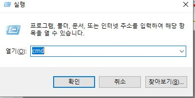
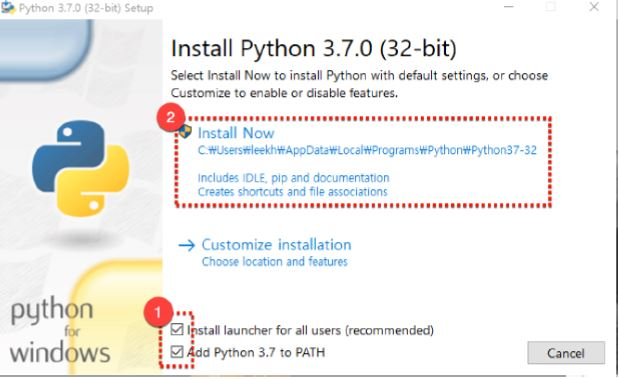
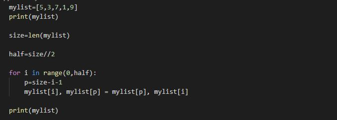

---
​---
layout : category
title:  "블로그 첫 글"
date: 2018-11-30
categories: ['일반']
tags: ['블로그', 'jekyll', 'github', 'github.io']
​---
---
# 파이썬 언어

<br><br>

## 1. 프로그래밍 언어의 이해

프로그래밍 언어란 주어진 어떤 문제를 해결하기 위해 **인간과 컴퓨터 사이에서 의사소통**을 가능케 하는 인공적인 언어이다.

프로그래밍 언어를 통해 사용자는 컴퓨터에게 일련의 일을 시키는 명령어들의 집합체인 프로그램을 작성할 수 있다.

<br><br>

## 2. 프로그래밍 언어의 종류

- 기계어 : 컴퓨터가 이해하는 언어로 2진수들의 집합으로 구성된다.

- 고급언어 : 사람이 이해할 수 있는 수준의 언어(C, C++, JAVA, Javascript, Python 등)

<br><br>

## 3. 파이썬 소개

1991년 `귀도 반 로섬`이 창시한 언어

<br>

### 1) 특징

- 프로그래밍 언어 중 가장 쉽고 간결한 문법을 가짐.
- 무료
- 빠른 개발 속도
- 인터프리터 언어
- 개체지향(Object) 프로그래밍
- 실행시간에 실시간으로 자료형 검사(변수 선언이 없음.)

<br>

### 2) 파이썬으로 할 수 있는 일
- 운영체제 시스템 유틸리티 제작
- GUI 프로그래밍
- C/C++과 결합
- 웹 프로그래밍(장고 프레임워크)
- 수치연산 프로그래밍(C기반의 모듈 Numeric Python 활용)
- 데이터베이스 프로그래밍
- 데이터 분석 사물 인터넷

<br>

### 3) 파이썬으로 할 수 없는 일
- 모바일 프로그래밍
- 시스템과 밀접한 프로그래밍 영역(대단히 빠른 속도를 요구하거나 하드웨어를 제어하는 일)

<br><br>

## 4. 파이썬 설치 여부 확인방법

<br>

### 1) 명령프롬프트
CLI(Command Line Interface, 통상적으로 명령어를 입력하기 위한 환경을 지칭하는 용어)
    - 윈도우(Window) 운영체제의 경우 명령프롬프트라는 프로그램이 존재함.
    - 맥이나 리눅스의 경우 터미널이라는 프로그램이 존재함.
#### 명령프롬프트 실행
Window에서 단축키 'WinKey+R'을 눌러 실행화면을 호출하고 'cmd'입력 후 Enter키를 누른다.


#### 명령프롬프트에서 파이썬 버전 확인 명령 수행하기

```cmd
python --version
```

#### 파이썬 내려 받기

파이썬 주소: <https://www.python.org>

※ 설치 프로그램 시 주의사항

Install launcher for all users(recommended)와 Add Python 3.7 to PATH의 체크박스를 클릭하고 진행



<br><br>

## 5. 파이썬 코드 작성

### 1) 소스코드를 작성


### 2) 소스코드 저장
확장자 이름을 py로 하여 저장.

ex) `HelloWorld.py`

### 3) 소스코드 실행

명령 프롬프트 혹은 shell을 통해서 실행 가능.

    `python 파일이름`
    
    ex) `python HelloWorld.py`

<br><br>

## 6. IDE(통합개발환경)를 사용한 소스코드 작성 및 실행

IDE(Intergrated Development Environment)은 코딩, 디버그, 컴파일, 배포 등 프로그램 개발에 관련된 모든 작업을 하나의 프로그램 안에서 처리하는 환경을 제공하는 소프트웨어입니다.

    - 코딩(coding) : 특정한 프로그래밍 언어를 이용해 구체적인 컴퓨터 프로그램을 구현하는 기술
    
    - 디버그(debug) : 컴퓨터 프로그램의 정확성이나 논리적인 오류(버그)를 찾아내는 테스트 과정
    
    - 컴파일(compile) : 소스코드를 실행한 형태로 변환하는 처리
    
    - 배포 : 최종 사용자에게 소프트웨어를 제공하는 과정

IDE로는 여러 프로그램이 있다.

    - Editplus, Sublime Text3, Atom, Braket, Visual Studio Code, Notepad++

참조: (https://blog.itpaper.co.kr/)의 교육자료
