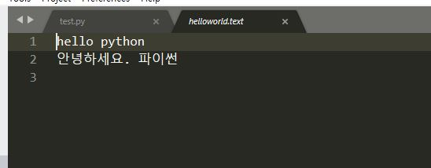

# 파일 입출력을 위한 내장함수

## 1. 파일 객체 생성하기

### 1) open()함수

파일을 저장하거나 읽을 수 있는 기능을 제공하는 파일 객체를 리턴하는 함수
```
객체이름 = open(파일경로, 읽기모드, encoding='인코딩')
```
- 파일 경로는 **상대경로**방식과 **절대경로** 방식이 가능하다.
- 지정된 파일이 존재하지 않을 경우 새로 생성하고, 존재할 경우 해당 파일을 불러온다.

#### 읽기 모드에 지정 가능한 값
|값|설명|
|:--:|:--:|
|r| 텍스트 읽기|
|w|텍스트 새로쓰기(기존내용 삭제)|
|a|텍스트 이어쓰기(기존내용 유지)|
|rb|바이너리(binary) 읽기|
|wb|바이너리 새로 쓰기|
|ab|바이너리 이어쓰기|

<br>

#### **인코딩**에 지정 가능한 값
|값| 설명|
|:--:|:--:|
|euc-kr|한국어 전용|
|utf-8|다국어 지원|

<br>

#### 인코딩
문자나 기호들의 집합을 컴퓨터에 저장하거나 통신에 사용할 목적으로 부호화하는 방법

|인코딩| 설명|
|:--:|:--|
|모스부호| 가장 원초적인 인코딩 방식으로 알파벳을 신호의 길이로 변환하여 표현한다.|
|ANSI(아스키코드)|미국 정보 교환 표준부호로서 7비트로 한 글자를 표현한다.|
|확장 ANSI|영문만 표현하는 7비트 부호체계에 조합형 글자를 위한 1비트를 추가하여 8비트로 한 글자를 표현한다. 대체로 국가별로 나누어진다.(euc-kr,euc-jp,euc-ch등) 한글 윈도우에서는 euc-kr에서 확장된 **cp949**방식을 사용한다.|
|UTF-8|확장 ANSI. 각 세부 방식별로 영어와 다른 국가 언어 한 가지만을 표현하던 방식에서 벗어나 **다국어를 한 번에 표현이 가능**한 인코딩 체계이다. 현재 대부분의 프로그램이 UTF-8방식을 기본으로 한다.|


<br><br>

## 2. 파일 객체를 통한 저장 기능 구현

open()함수를 통해 파일 객체 f를 리턴 받은 후 f객체의 writer()함수를 사용하여 파일에 내용을 기록한다.

```python
f = open("helloworld.txt", "w", encoding="utf-8")

f.write("hello python\n")
f.write("안녕하세요. 파이썬\n")

#open()함수를 단독으로 사용할 경우 파일 작업 완료 후 닫기를 반드시 수행.
f.close()
```



<br><br>

## 3. 파일 객체를 통한 읽기 기능 구현
"파일을 읽는다(불러온다)"는 말은 파일에 저장되어 있는 내용을 변수에 담는다는 의미이다.

```python
f = open("helloworld.txt", "r", encoding='utf-8')
data = f.read()
print(data)

#open()함수를 단독으로 사용할 경우 파일 작업 완료 후 닫기를 반드시 수행.
f.close()
```
```
hello python
안녕하세요. 파이썬
```

<br><br>

## 4. with문을 사용한 파일 객체 사용

```python
with open("hellopython.txt", "w", encoding='utf-8') as f:
    #with scope 안에서만 파일 객체 f가 유효함
    for i in range(0, 10):
        f.write("%d>>" %i)
        f.write("life is too short,")
        f.write("you need python\n")

    print("파일 저장이 완료되었습니다.")

with open("hellopython.txt", "r", encoding='utf-8') as f:
    data = f.read()
    print(data)
```
```
파일 저장이 완료되었습니다.
0 >> life is too short, you need python
1 >> life is too short, you need python
2 >> life is too short, you need python
3 >> life is too short, you need python
4 >> life is too short, you need python
5 >> life is too short, you need python
6 >> life is too short, you need python
7 >> life is too short, you need python
8 >> life is too short, you need python
9 >> life is too short, you need python
```

<br><br>

## 5. 파일 내용을 리스트로 가져오기

readlines() 함수는 파일의 내용을 한 줄씩 리스트로 변환하여 읽는다.
```python
with open("helloworld.txt", "r", encoding='utf-8') as f:
    lines = f.readlines()
    print(lines)
    print('-'*10)

    size = len(lines)
    print("읽어들인 데이터는 총 %d줄 입니다." % size)
    print('-'*10)

    for item in lines:
        #공백제거
        print(item.strip())
```
```
['hello python\n', '안녕하세요. 파이썬\n']
----------
읽어들인 데이터는 총 2 줄 입니다.
    -- -- -- -- --
hello python
안녕하세요.파이썬
```

참조: (https://blog.itpaper.co.kr/)의 교육자료