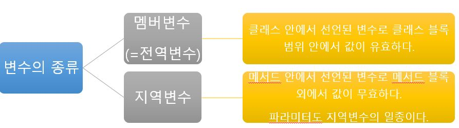

# 파이썬 객체지향(2)

## 멤버변수의 범위

### 지역변수와 전역변수
 - 클래스에 멤버변수와 메서드가 공존할 경우, 멤버변수는 모든 메서드가 공유하는 전역변수로 존재한다.
 

<br>

### 멤버변수에 접근하기 위한 self의 용법
- 클래스에 속한 메서드에서 멤버변수에 접근은 `self`를 통해서만 접근할 수 있다.
- 클래스 안의 모든 메서드가 멤버변수를 공유할 수 있지만 파라미터나 메서드 안에서 최초로 생성된 변수는 그 메서드를 벗어날 수 없다.
```python
class User:
    user_id = None

    def setUserId(self, user_id):
        self.user_id = user_id
    def getUserId(self):
        return self.user_id

u = User()

u.setUserId("helloworld")

uid = u.getUserId()
```
<br>

#### 예제코드

- 멤버변수와 메서드를 모두 내장하는 객체
```python
class Member:
	username=""
	email=""

	def join(self, username, email):
		self.username=username
		self.email=email

	def view_info(self):
		print(self.username)
		print(self.email)

mem1 = Member()
mem1.join("Python", "python@gmail.com")
mem1.view_info()
```
```
Python
python @gmail.com
```

<br><br>

## 2. 생성자
- 객체가 생성될 때 자동으로 실행되는 특수한 메서드

값을 리턴하지 않으며 생성자의 이름은 `__init__`(__ = **double under bar**)로 미리 정해져 있다.

```
class Foo:
    def __init__(self):
    // 객체가 생성될 때 자동으로 호출됨.
```

자동으로 실행되는 특성으로 활용하여 객체가 생성될 때 해당 객체의 특성을 초기화 하기 위해 사용된다.

<br>

#### 에제 코드
- 생성자를 갖는 클래스를 정의하기
```python
class Member:
	username =None
	email = None

	def __init__(self,username, email):
		print("------생성자가 실행되었습니다.----")
		self.username=username
		self.email=email

	def view_info(self):
		tpl ="이름: {0} / 이메일: {1}"
		print(tpl.format(self.username,self.email))

mem1 = Member("푸우", "foo@gmail.com")
mem1.view_info()
```
```
-- -- --생성자가 실행되었습니다.-- --
이름: 푸우 / 이메일: foo@gmail.com
```

<br><br>

## 3. 파라미터를 갖는 생성자
생성자도 메서드이므로 파라미터를 정의할 수 있다.

- 생성자 외부에서 초기화된 변수를 생성자의 멤버변수로 사용할 수 있다.(즉, )
```python
class Foo:
    name = None
    age = None

    def __init__(self, name, age):
        //생성자 파라미터의 값을 멤버변수에 복사
        self.name = name;
        self.age = age;
```

- 파라미터가 정의된 생성자는 객체 생성시 구문에서 해당 파라미터를 전달해야 한다.
```python
object = Foo("푸우",15)
```

<br>

#### 예제코드
- 파라미터를 갖는 생성자를 정의
```python
class Member:
	username =None
	email = None

	def __init__(self,username, email):
		print("------생성자가 실행되었습니다.----")
		self.username=username
		self.email=email

	def view_info(self):
		tpl ="이름: {0} / 이메일: {1}"
		print(tpl.format(self.username,self.email))

mem1 = Member("푸우", "foo@gmail.com")
mem1.view_info()
```
```
-- -- --생성자가 실행되었습니다.-- --
이름: 푸우 / 이메일: foo@gmail.com
```
<br>

- 멤버변수, 생성자, 메서드를 포함하는 클래스 정의하기
```python
class Unit:
	name = None
	hp = None
	dps = None

	def __init__(self,name, hp, dps):
		self.name = name
		self.hp = hp
		self.dps = dps
		print("[%s] 체력 : %d, 공격력 : %d" %(name, hp, dps))

	def move(self, position):
		print("%s(이)가 %s까지 이동합니다."%(self.name, position))

	def attack(self, target):
		print("%s(이)가 %s(을)를 공격합니다. 데미지 : %d" %(self.name,target, self.dps))

u1=Unit("질럿1호", 100,10)
u2=Unit("질럿2호", 100,12)
u3=Unit("드라군1호", 120,20)
u4=Unit("드라군2호", 150,35)

u1.move('적 본진')
u3.move('적 본진')
u1.attack('적 본진')
u3.attack('적 본진')
print("-"*30)

u2.move('적 멀티')
u4.move('적 멀티')
u2.attack('적 멀티')
u4.attack('적 멀티')
```
```
[질럿1호] 체력 : 100, 공격력 : 10
[질럿2호] 체력 : 100, 공격력 : 12
[드라군1호] 체력 : 120, 공격력 : 20
[드라군2호] 체력 : 150, 공격력 : 35
질럿1호(이)가 적 본진까지 이동합니다.
드라군1호(이)가 적 본진까지 이동합니다.
질럿1호(이)가 적 본진(을)를 공격합니다. 데미지 : 10
드라군1호(이)가 적 본진(을)를 공격합니다. 데미지 : 20
------------------------------
질럿2호(이)가 적 멀티까지 이동합니다.
드라군2호(이)가 적 멀티까지 이동합니다.
질럿2호(이)가 적 멀티(을)를 공격합니다. 데미지 : 12
드라군2호(이)가 적 멀티(을)를 공격합니다. 데미지 : 35
```

참조: (https://blog.itpaper.co.kr/)의 교육자료